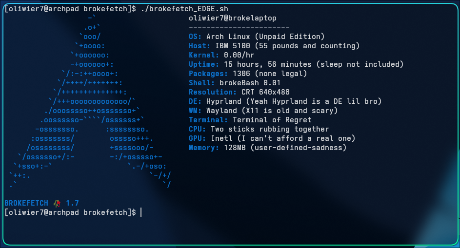

# brokefetch


[](https://repology.org/project/brokefetch/versions)

A broken `neofetch` clone for those of us who have no job, no GPU, no money, and no hope.




Version 1.0 screenshot


## What is this?

`brokefetch` is the only system info tool that doesn't pretend your life is okay.

Inspired by `neofetch`, but with:
- Sadness
- Regret
- A CRT monitor

## Installation

```bash
git clone https://github.com/Szerwigi1410/brokefetch
cd brokefetch
chmod +x brokefetch.sh
./brokefetch.sh
```
### using install.sh
```bash
git clone https://github.com/Szerwigi1410/brokefetch
cd brokefetch
chmod +x install.sh
./install.sh
```
### or use the installer "OS-wide"(experemental)

```bash
curl -sSL https://raw.githubusercontent.com/Szerwigi1410/brokefetch/refs/heads/main/install.sh > install.sh ; chmod +x install.sh ; bash -c "./install.sh" ; rm -f install.sh
```

### AUR (yes it's back)
```bash
yay -S brokefetch-git
```

### Homebrew
```bash
brew tap T1mohtml/brokefetch
brew install brokefetch
```
---
# Important note!

- `brokefetch.sh` - Stable, "just works"
- `brokefetch_beta.sh` - Might contain bugs, has the newest features
- `brokefetch_EDGE_legacy.sh` - just a backup of the old edge version (currently not present)
- `brokefetch_mod.sh` - a version of EDGE that loads the logos from ~/.config/brokefetch/logos (mod stands for **mod**ular). Currently supports 485 ascii logos!

(brokefetch_EDGE got renamed to brokefetch_beta)

---
# Troubleshooting
If you have any issues with brokefetch, try to remove the config and run brokefetch again.

---

### 💖 If you enjoy brokefetch, please ⭐ it here and vote on the [AUR package](https://aur.archlinux.org/packages/brokefetch-git) to support its survival!

### ~Sadly we lost and some cock sucke- uhh I meant AUR trusted user has removed the package from AUR.~

### yay `brokefetch is back on the aur 🥳` ###

### give it a try

```bash
yay -S brokefetch-git
```
[](https://repology.org/project/brokefetch/versions)


