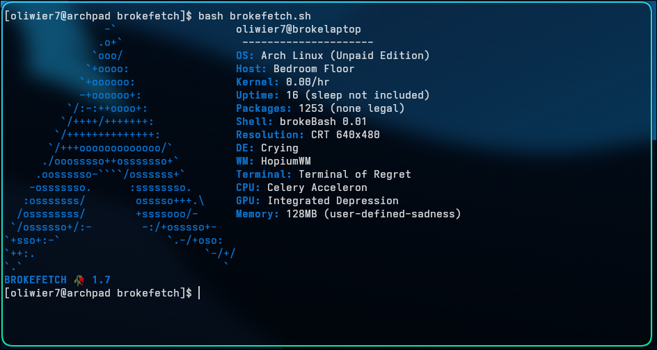

# brokefetch

A broken `neofetch` clone for those of us who have no job, no GPU, and no hope.



Version 1.0 screenshot


## What is this?

`brokefetch` is the only system info tool that doesn't pretend your life is okay.

Inspired by `neofetch`, but with:
- Sadness
- Regret
- A CRT monitor

## Installation

```bash
git clone https://github.com/Szerwigi1410/brokefetch
cd brokefetch
chmod +x brokefetch.sh
./brokefetch.sh
```
---
# If you have any issues with brokefetch, try to remove the config and run brokefetch again.
---
~### 💖 If you enjoy brokefetch, please ⭐ it here and vote on the [AUR package](https://aur.archlinux.org/packages/brokefetch) to support its survival!~

### Sadly we lost and some cock sucke- uhh I meant AUR trusted user has removed the package from AUR.
